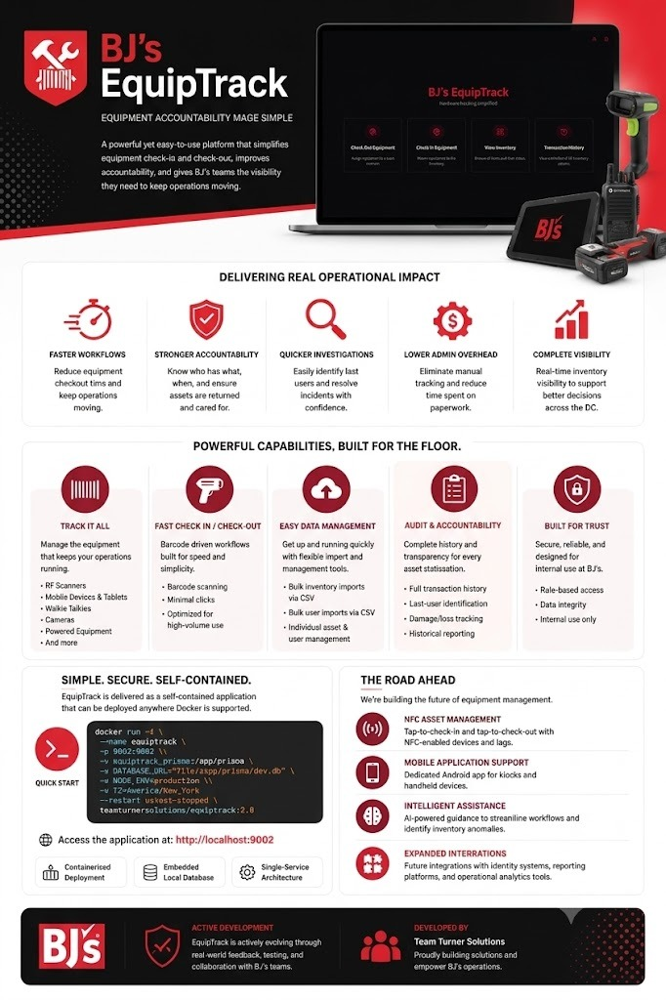
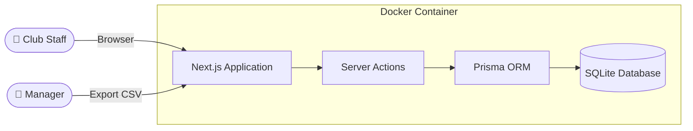

<div align="center">


# BJ's EquipTrack (Presentation Demo)

### Intelligent Equipment & Inventory Management

[](#-getting-started)
[](#-technical-overview)
[](#-technical-overview)
[](#)

**A professional, commercial-grade demonstration environment for BJ's stakeholders.**

**Built to eliminate manual processes, reduce equipment loss, and streamline shift handoffs.**

</div>

---

## 📺 Application Preview & Demo Video

Watch the walkthrough video showing BJ's EquipTrack's barcode scanning, real-time tracking, and administrative capabilities:

<p align="center">
  <video src="BJs-EquipTrack-Application-Preview.mp4" width="100%" controls poster="Equiptrack-Dashboard.png" style="border-radius: 8px; box-shadow: 0 4px 12px rgba(0,0,0,0.15);">
    Your browser does not support the video tag.
  </video>
</p>

---

## 📋 Presentation Overview & Handout Infographic

Below is the executive presentation handout outlining the business impact, system capabilities, and deployment architecture of **BJ's EquipTrack**.

<p align="center">
  <a href="equiptrack-handout-v2.jpeg" target="_blank">
    
  </a>
</p>

<p align="center">
  <em>🔍 Click the image above or open <a href="equiptrack-handout-v2.jpeg">equiptrack-handout-v2.jpeg</a> to view the full high-resolution handout.</em>
</p>

---

## 💡 The Problem

Managing shared equipment across a busy warehouse club floor is a daily challenge:

| Pain Point | Impact |
|:---|:---|
| **Paper sign-out sheets** get lost, damaged, or ignored | No reliable record of who has what |
| **No accountability** when equipment is damaged or missing | Increased replacement costs |
| **Slow manual processes** for checking equipment in and out | Wasted labor hours every shift |
| **No visibility** into equipment status at a glance | Supervisors can't make informed decisions |

---

## ✅ The Solution

**EquipTrack** replaces manual tracking with a fast, intuitive digital system purpose-built for the warehouse floor.

### 🎯 Key Capabilities

<table>
<tr>
<td width="50%">

#### ⚡ Rapid Barcode Scanning
Equipment check-out and check-in in **under 5 seconds** using Code128 barcode scanning. Designed for speed — no training required.

</td>
<td width="50%">

#### 📋 Multi-Equipment Tracking
Manages **RF units, iPads, radios, cameras, banders, grinders** and any other club equipment — all from one interface.

</td>
</tr>
<tr>
<td width="50%">

#### 🔍 Full Accountability Trail
Every check-out and check-in is logged with **who, what, and when**. Instantly identify the last user of any piece of equipment.

</td>
<td width="50%">

#### 📥 Bulk Data Import
Onboard hundreds of team members or inventory items in seconds via **CSV upload** — no manual data entry needed.

</td>
</tr>
<tr>
<td width="50%">

#### 📊 Real-Time Dashboard
At-a-glance view of all equipment status — **available, checked out, and by whom**. Supervisors always know what's in the field.

</td>
<td width="50%">

#### 📤 Export & Reporting
Download complete transaction history as **CSV** for auditing, compliance, or integration with existing reporting workflows.

</td>
</tr>
</table>

---

## 📈 Business Impact

| Metric | Before EquipTrack | With EquipTrack |
|:---|:---|:---|
| **Equipment check-out time** | 2–5 minutes (paper) | < 5 seconds (scan) |
| **Damage accountability** | Unknown | 100% traceable |
| **Shift-start equipment distribution** | Chaotic, inconsistent | Streamlined, auditable |
| **Equipment loss visibility** | Discovered weeks later | Real-time awareness |
| **Data entry for new hires/equipment** | Manual, one-by-one | Bulk CSV import |

---

## 🏗️ Technical Overview & Architecture

Designed to be simple to deploy and highly reliable under heavy load.

| Component | Details |
|:---|:---|
| **Architecture** | Full-stack monolith — single containerized application |
| **Frontend** | Next.js 15 (React 19) with responsive, mobile-friendly UI |
| **Database** | SQLite — embedded, zero-configuration, file-based |
| **ORM** | Prisma 6 — type-safe data access with migration support |
| **Containerization** | Docker — fully self-contained, runs on any machine with Docker installed |
| **Port** | `9002` |
| **Data Persistence** | Docker volume mount ensures data survives container restarts |

### System Architecture



---

## 🚀 Run the Demo Environment

This demo repository is designed to be **run-ready** for immediate presentation. The SQLite database is automatically built and pre-seeded with clean mock team members and equipment.

### Option 1: Docker Compose (Quickest)

1. Clone this repository:
   ```bash
   git clone https://github.com/teamturnersolutions/bjs-equiptrack-demo.git
   cd bjs-equiptrack-demo
   ```
2. Start the container:
   ```bash
   docker compose up -d
   ```

### Option 2: Docker Run

```bash
docker run -d \
  --name equiptrack-demo \
  -p 9002:9002 \
  -v equiptrack_demo_prisma:/app/prisma \
  -e DATABASE_URL="file:/app/prisma/dev.db" \
  -e NODE_ENV=production \
  -e TZ=America/New_York \
  --restart unless-stopped \
  teamturnersolutions/equiptrack-demo:latest
```

### Accessing the Web Interface

Open your browser and navigate to:
🌐 **[http://localhost:9002](http://localhost:9002)**

> [!NOTE]
> **Pre-Seeded Accounts & Data:** The database comes pre-populated with realistic mock employees (e.g. *Javon Adams*, *James Turner*, *Roberto Coldutty*) and typical warehouse club assets, allowing you to demo check-out and check-in functionality instantly.

---

## 🗺️ Roadmap & Next Steps

Planned enhancements to further streamline club operations:

| Feature | Description | Status |
|:---|:---|:---|
| **NFC Integration** | Tap-and-go check-ins using NFC tags on equipment | 🔜 Planned |
| **AI Agent** | Intelligent assistant for proactive equipment issue resolution | 🔜 Planned |
| **Mobile App** | Dedicated Android application for handheld devices | 📋 Backlog |
| **Multi-Location** | Support for tracking across multiple club locations | 📋 Backlog |

---

<div align="center">

**Built by [Team Turner Solutions](https://github.com/teamturnersolutions)**

*For support, feature requests, or deployment assistance — contact the development team.*

</div>
