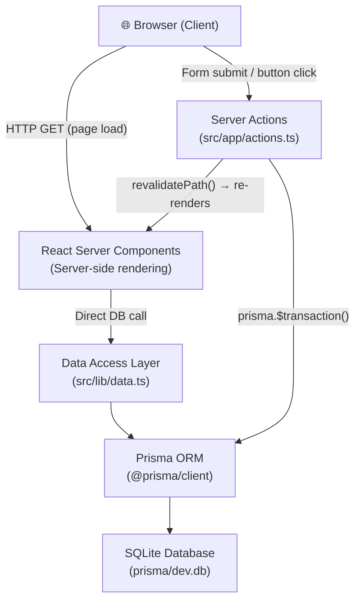
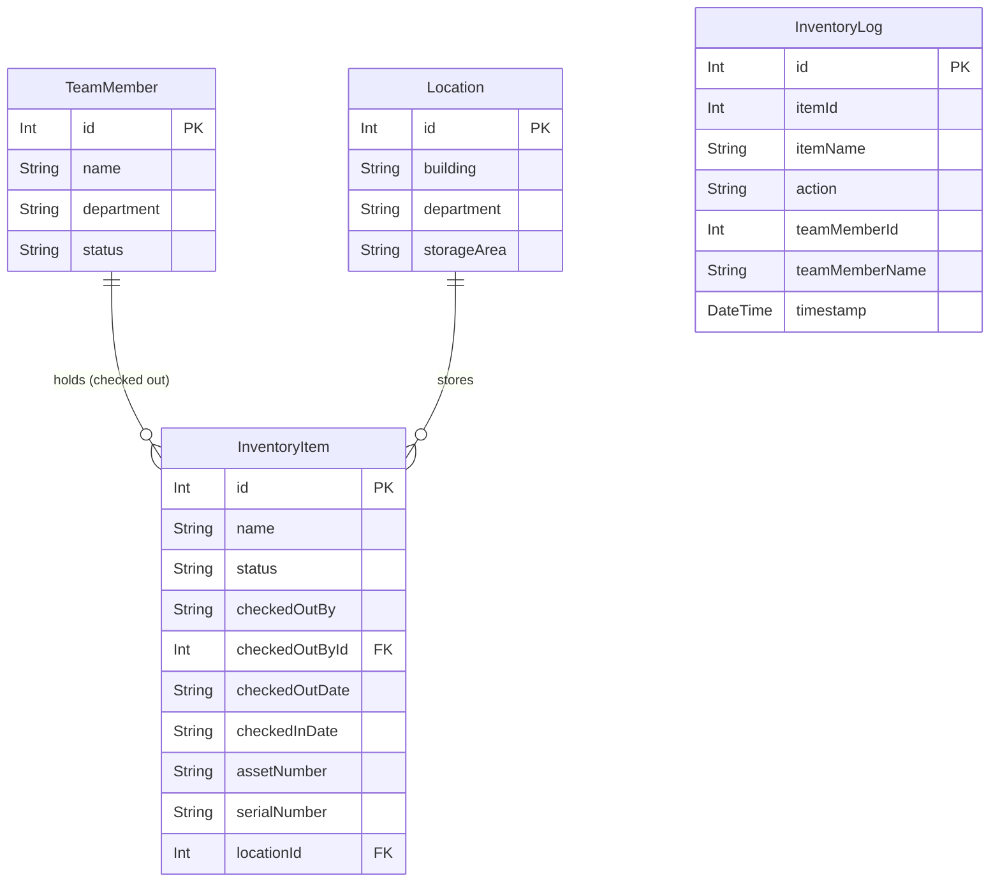
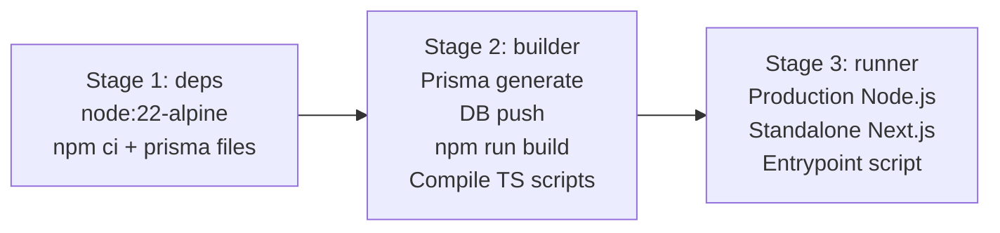

# BJs EquipTrack — Architecture Walkthrough

## TL;DR

This is a **Next.js 15 full-stack monolith** where the database, business logic, and UI all live inside a single application process. Data mutations flow via **Next.js Server Actions** and reads are performed directly in **React Server Components (RSCs)** using **Prisma ORM**.

---

## Architecture Pattern: Full-Stack Monolith (Next.js App Router)



> [!IMPORTANT]
> There are **no REST or GraphQL API controllers**. The single API route (`/api/export/history`) is only for CSV file downloads. All mutations go through Server Actions, which are RPC-style functions that run on the server only.

---

## Tech Stack

| Layer | Technology |
|---|---|
| Framework | Next.js 15 (App Router) with Turbopack |
| Language | TypeScript 5 |
| UI | React 19 + Radix UI + Tailwind CSS v3 |
| Forms | `react-hook-form` + Zod validation |
| ORM | Prisma 6.x (6.19.2) |
| Database | SQLite (file: [prisma/dev.db](file:///c:/Users/teamt/bjs-equiptrack-demo/prisma/dev.db)) |
| Icons | `lucide-react` |
| Containerization | Docker (multi-stage) + Docker Compose |
| Runtime | Node.js 22 Alpine |

---

## Database Schema (4 Models)

Defined in [prisma/schema.prisma](file:///c:/Users/teamt/bjs-equiptrack-demo/prisma/schema.prisma).



### Key Design Notes
- **`InventoryItem.status`** is a `String` (not an enum) — values are `"Available"` or `"Checked Out"`.
- **`InventoryLog`** is an **immutable append-only ledger**. Every `CHECKOUT`, `CHECKIN`, `REASSIGN`, `RETURN`, and `CORRECT` event writes a new row. Team member name and item name are **denormalized** into the log row (so history survives deletions).
- **Optional Fields**:
  - `TeamMember.department` and `TeamMember.status` are optional.
  - `InventoryItem.checkedOutBy`, `InventoryItem.checkedOutById`, `InventoryItem.checkedOutDate`, `InventoryItem.checkedInDate`, `InventoryItem.assetNumber`, `InventoryItem.serialNumber`, and `InventoryItem.locationId` are optional.
  - `InventoryLog.teamMemberId` and `InventoryLog.teamMemberName` are optional.
- **No auth model** — the system is currently open/un-authenticated.
- **No soft-delete** — items are hard deleted.
- Dates (`checkedOutDate`, `checkedInDate`) are stored as `String` (ISO 8601), not native `DateTime`.

---

## Application Routes

| Route | Type | Purpose |
|---|---|---|
| `/` | RSC | Home dashboard — nav cards to all sections |
| `/checkout` | RSC + Client | Select team member → select items → checkout |
| `/checkin` | RSC + Client | Select items to return to inventory |
| `/inventory` | RSC + Client | Browse all items, filter Available / Checked Out |
| `/history` | RSC | View last 100 checkout/checkin events |
| `/members` | RSC + Client | Team Members roster view and edit team members |
| `/audit` | RSC + Client | Audit view (per-member equipment) |
| `/api/export/history` | Route Handler | CSV download of transaction history |

All routes under `/(app)/` share a layout wrapper ([layout.tsx](file:///c:/Users/teamt/bjs-equiptrack-demo/src/app/layout.tsx)).

---

## Feature Breakdown

### 1. Equipment Checkout
**Files**: [/checkout/page.tsx](file:///c:/Users/teamt/bjs-equiptrack-demo/src/app/(app)/checkout/page.tsx), [actions.ts#checkOutEquipment](file:///c:/Users/teamt/bjs-equiptrack-demo/src/app/actions.ts)

- User selects a team member from a dropdown (RSC pre-fetches all [TeamMember](file:///c:/Users/teamt/bjs-equiptrack-demo/src/lib/types.ts#L1-L5) records).
- Multi-select checkboxes for available items.
- On submit → Server Action [checkOutEquipment(teamMemberId, itemIds[])](file:///c:/Users/teamt/bjs-equiptrack-demo/src/app/actions.ts#L41-L101):
  1. Validates all items are still `"Available"`.
  2. Runs a `prisma.$transaction()` that:
     - Updates each [InventoryItem](file:///c:/Users/teamt/bjs-equiptrack-demo/src/lib/types.ts#L6-L15) status → `"Checked Out"` and records who/when.
     - Inserts an `InventoryLog` row per item with action `"CHECKOUT"`.
  3. Calls `revalidatePath()` on all affected routes to purge Next.js cache.

### 2. Equipment Check-In
**Files**: [/checkin/page.tsx](file:///c:/Users/teamt/bjs-equiptrack-demo/src/app/(app)/checkin/page.tsx), [actions.ts#checkInEquipment](file:///c:/Users/teamt/bjs-equiptrack-demo/src/app/actions.ts)

- Shows only items with `status = "Checked Out"`.
- On submit → [checkInEquipment(itemIds[])](file:///c:/Users/teamt/bjs-equiptrack-demo/src/app/actions.ts#L102-L162):
  1. Validates items are not already available.
  2. Atomic transaction: resets item status, clears checkout fields, logs `"CHECKIN"` event (preserving the original holder's name in the log).

### 3. Inventory View
**File**: [/inventory/page.tsx](file:///c:/Users/teamt/bjs-equiptrack-demo/src/app/(app)/inventory/page.tsx)

- Displays all inventory items with their live status.
- Filterable by [Available](file:///c:/Users/teamt/bjs-equiptrack-demo/src/lib/data.ts#L46-L59) / `Checked Out`.
- Uses [getInventoryItems()](file:///c:/Users/teamt/bjs-equiptrack-demo/src/lib/data.ts#L17-L28) from the DAL.

### 4. Transaction History
**File**: [/history/page.tsx](file:///c:/Users/teamt/bjs-equiptrack-demo/src/app/(app)/history/page.tsx)

- Renders last **100** `InventoryLog` rows, ordered by `timestamp DESC`.
- Color-coded badges: blue for CHECKOUT, green for CHECKIN.
- **Export to CSV** button → hits `/api/export/history` which streams a CSV response.

### 5. Audit View
**File**: [/audit/page.tsx](file:///c:/Users/teamt/bjs-equiptrack-demo/src/app/(app)/audit/page.tsx)

- Per-member view: shows which items each team member currently holds.
- Useful for accountability / damage tracking.

### 6. Data Management (Home Page Controls)
**Files**: [home-management-controls.tsx](file:///c:/Users/teamt/bjs-equiptrack-demo/src/app/_components/home-management-controls.tsx), [management-sheets.tsx](file:///c:/Users/teamt/bjs-equiptrack-demo/src/app/_components/management-sheets.tsx), [bulk-import-sheet.tsx](file:///c:/Users/teamt/bjs-equiptrack-demo/src/app/_components/bulk-import-sheet.tsx)

Three slide-in Sheet panels available from the home screen:

| Sheet | Function |
|---|---|
| **Add Member** | Single team member entry. Supports a "continuous mode" (keep open after submit) for rapid barcode-scanner-driven entry. |
| **Add Item** | Single inventory item entry. Same continuous mode for scanner workflows. |
| **Bulk Import** | Paste raw CSV text → auto-parses header detection, imports many items or members at once. Deduplicates by name. |

---

## Data Flow: Full Mutation Lifecycle

```
User clicks "Checkout" button
        ↓
Client component calls: checkOutEquipment(memberId, [item1, item2])
        ↓
[Server Action - runs on Node.js server]
  → getTeamMemberById(memberId)   ← DAL call
  → getInventoryItems()           ← DAL call
  → validate availability         ← In-memory check
  → prisma.$transaction([
        inventoryItem.update × N,   ← atomic writes
        inventoryLog.create × N     ← audit trail
    ])
  → revalidatePath('/inventory')   ← bust cache
  → revalidatePath('/history')
  → return { success: true }
        ↓
Next.js re-renders affected RSC pages (server-side)
        ↓
Browser receives updated HTML
```

---

## Component Architecture

```
src/
├── app/
│   ├── page.tsx                      ← Home (RSC)
│   ├── actions.ts                    ← All Server Actions (mutations)
│   ├── layout.tsx                    ← Root layout
│   ├── globals.css
│   ├── _components/                  ← Home-specific client components
│   │   ├── home-management-controls.tsx
│   │   ├── management-sheets.tsx     ← Add Member / Add Item sheets
│   │   ├── bulk-import-sheet.tsx     ← CSV import UI
│   │   └── management-section.tsx
│   ├── (app)/                        ← Route group (shared layout)
│   │   ├── layout.tsx
│   │   ├── checkout/_components/
│   │   ├── checkin/_components/
│   │   ├── inventory/_components/
│   │   ├── audit/_components/
│   │   └── history/page.tsx
│   └── api/export/history/           ← CSV export route handler
├── components/
│   ├── app-header.tsx                ← Shared page header
│   ├── inventory-card.tsx            ← Reusable item card
│   └── ui/                           ← Radix UI / shadcn primitives
│       ├── button, card, dialog,
│       ├── sheet, select, checkbox,
│       ├── tabs, toast, input, etc.
├── lib/
│   ├── prisma.ts                     ← Singleton Prisma client
│   ├── data.ts                       ← Data Access Layer (DAL)
│   ├── types.ts                      ← TeamMember, InventoryItem types
│   └── utils.ts                      ← cn() classname helper
└── hooks/
    └── use-toast.ts
```

---

## Docker / Deployment

The app ships as a **single Docker container** with a **3-stage build**:



- **Port**: `9002`
- **Database**: SQLite file mounted via Docker volume at `./prisma:/app/prisma`
- **Entrypoint** ([docker-entrypoint.sh](file:///c:/Users/teamt/bjs-equiptrack-demo/docker-entrypoint.sh)): Initializes DB if missing, then runs `node server.js`
- **Timezone**: `America/New_York`
- **Image**: `teamturnersolutions/equiptrack:demov3`

> [!NOTE]
> Because the DB is a **volume-mounted SQLite file**, data persists across container restarts. This is an important operational dependency — if the volume is lost, so is all data.

---

## Strengths & Current Limitations

| ✅ Strengths | ⚠️ Limitations |
|---|---|
| Zero-overhead, no API layer needed | SQLite is single-writer; no concurrent writes from multiple processes |
| Server Actions make mutations type-safe | No authentication/authorization layer |
| Atomic transactions prevent partial state | History capped at 100 rows in UI (DB stores all) |
| Full audit trail via `InventoryLog` | Dates stored as strings, not `DateTime` (minor) |
| Barcode scanner–optimized UX (continuous mode) | No NFC support yet (planned) |
| Portable Docker image, single container | No role-based access control |
| CSV bulk import for rapid onboarding | No item categories or equipment types at DB level |
