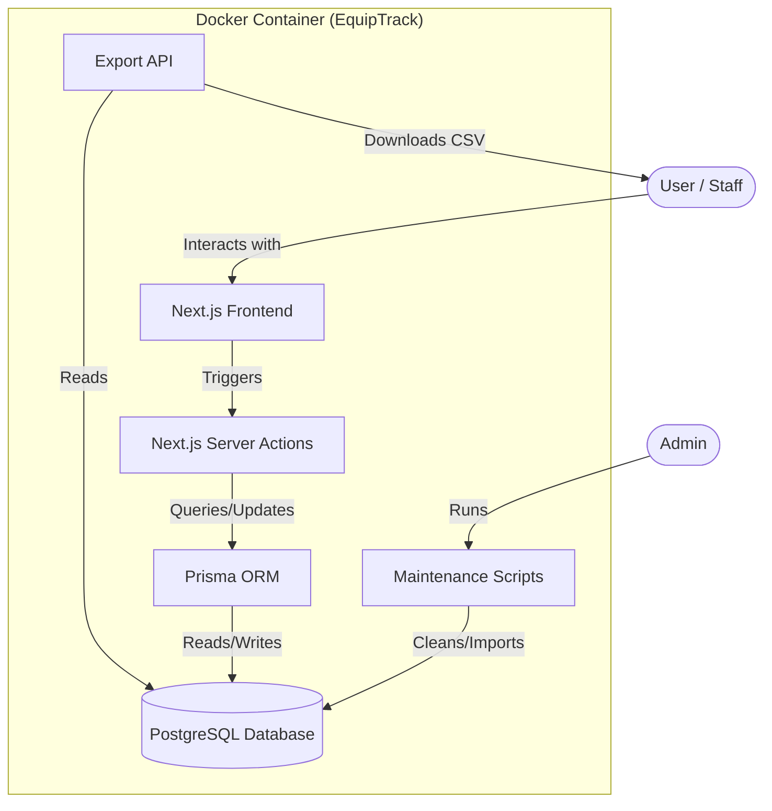

# BJ's EquipTrack Systems Flow

This document provides a visual representation and walkthrough of the systems flow for BJ's EquipTrack, a containerized inventory management application built with Next.js 15, PostgreSQL, and Prisma.
## Systems Flow Diagram

The diagram below depicts how users and administrators interact with the application, its internal components, and the underlying data storage within a Docker container.

## Component Breakdown

### 1. **Next.js Frontend (WebUI)**

The user interface, accessible at `http://localhost:9002`, provides dedicated views for checking equipment in/out, viewing inventory, and tracking transaction history.

### 2. **Server Actions**

Next.js Server Actions handle business logic, such as [checkOutEquipment](file:///c:/Users/teamt/bjs-equiptrack-demo/src/app/actions.ts#L41-L101) and [checkInEquipment](file:///c:/Users/teamt/bjs-equiptrack-demo/src/app/actions.ts#L102-L162), providing a secure bridge between the frontend and the database.

### 3. **Prisma ORM & PostgreSQL**

Prisma acts as the data access layer, managing schemas and performing type-safe queries on a PostgreSQL database. This data is persisted using Docker volumes.

### 4. **Export API**

A dedicated REST endpoint (`/api/export/history`) allows users to download the transaction history as a CSV file directly from the WebUI.

### 5. **Maintenance Scripts**

A collection of utility scripts, such as `migrate-csv.ts` and `cleanup-logs.ts`, are used by administrators to manage the application's data state, typically executed via `docker compose exec`.

## Production Readiness

| Feature              | Status                                                            |
| :------------------- | :---------------------------------------------------------------- |
| **Containerization** | Fully Dockerized for zero-dependency deployment.                  |
| **Persistence**      | PostgreSQL database persists via host-mounted volumes.                |
| **Data Integrity**   | Prisma ORM ensures consistent data models for tracking equipment. |
| **Exportability**    | Built-in CSV export for all transaction logs.                     |
